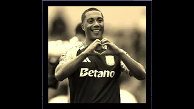

# Unit 5 - Personal Narrative / Interest Animation

## Introduction

Images are often used to portray our personal experiences and interests. We also use image filters and effects to change or enhance the mood of an image. When combined into collages and presentations, these images tell a story about who we are and what is important to us. Your goal is to create an animation using The Theater and Scene API that consists of images of your personal experiences and/or interests. In this animation, you will incorporate data related to these experiences and/or interests that can be organized in a 2D array, and use image filters and effects to change or enhance the mood of your images.
## Requirements

Use your knowledge of object-oriented programming, two-dimensional (2D) arrays, and algorithms to create your personal narrative collage or animation:
- **Write Scene subclasses** – Create two Scene subclasses: either two core parts of your personal life, or two components of a personal interest. Each class must contain a constructor and private instance variable with data related to the scene
- **Create at least two 2D arrays** – Create at least two 2D arrays to store the data that will make up your visualization.
Implement algorithms – Implement one or more algorithms that use loops and logic that operate on the data in your 2D arrays.
- **Create a visualization** – Create an animation that conveys the story of the data by illustrating the patterns or relationships in the data.
- **Image Filters** – Utilize the image filters created in this unit (and possible new filters) that show a personal flare to the images used in your animation.
- **Document your code** – Use comments to explain the purpose of the methods and code segments and note any preconditions and postconditions.

## UML Diagram

## Video

## Story Description

My animation showcases players and teams of one of my favorite sports, soccer. First, it displays the logos of the top three teams of the Premier League (Arsenal F.C., Manchester City F.C., and Aston Villa F.C.) and displays images of each team's top three players. In the second scene, the logos of the top teams that have qualified for the upcoming 2026 World Cup are drawn. I chose the three best teams from the three most competitive continents (Europe, Africa, and South America) and sorted them by their continent. Both the players from the Premier League in the first scene and the World Cup teams in the second scene are stored in and accessible from 2D arrays. In the players 2D array, the rows represent the Premier League teams and the columns represent the players in the teams. In the (World Cup) teams 2D array, which is separate from the Premier League teams, the rows represent the continents and the columns represent the World Cup teams.

## Image Filter Analysis

In my animation, two filters that I used were random() and applySepia(). The random() method filter was one I created on my own; it sets all of the pixels' RGB values to random integers, still between 0 and 255 of course. The resulting image is a mess of randomly colored pixels, very similar to a static screen. The applySepia() filter was from this unit; the method modifies the pixels by setting each of the pixels' RGB values to the sum of the current RGB values multiplied by specific doubles. The resulting image is a warm-toned, brownish version of the image that resembles photography during the 1800s.